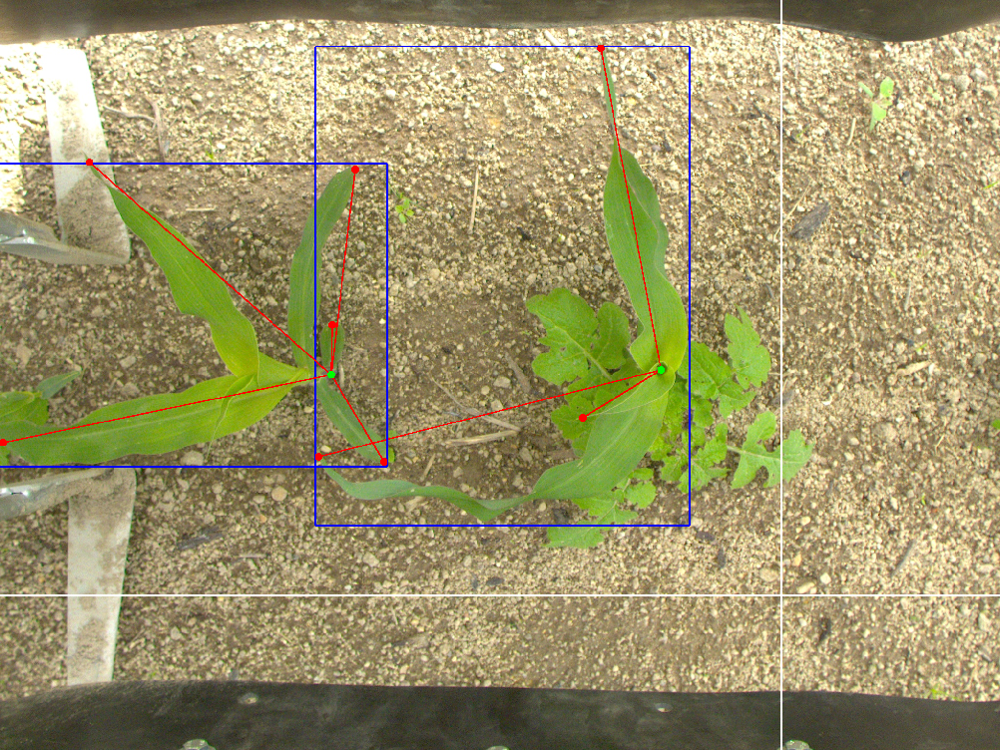

# StructureAnnotator 
Software for annotating images with the structure of crops. It was coded with the a\*s in the urge, hope mom and dad won't find out. Use at you own risk. Work still in progress and document is not complete.

## Requirements
- Python3
- OpenCV

## How to Use
- Download the project, unzip, open a terminal and `cd` in the main directory.
- Launch the software with `python3 main.py`.
- Quit with keyboard command `q`.

This software can annotate crops, which are composed of one stem (green), many leaves (red) and one optional bounding box (blue). The crop parts (stem and leaves) are represented as keypoints. Here is the list of commands and actions:
- Double click (left): add a keypoint to the current crop being annotated. The first one will be the stem and the others leaves.
- Drag Gesture (middle click, sorry trackpad users, will update soon): add a bounding box to the current crop.
- Command `a`: creates a new crop. A new crop is automatically generated if none are present on the current image while issuing a creation command.
- Command `z`: undo the last action. Because this software was coded with the a\*s redo is not implemented and if present the bounding box is deleted first.
- Command `q`: quits the program.

## Todo
- [ ] Add commands to change image
- [ ] Add a command to save annotation
- [ ] Command to change folder?
- [ ] Drag gesture with left button instead of middle one

## Will Never Do
- Clean code and refactor
- Add new functionnality
