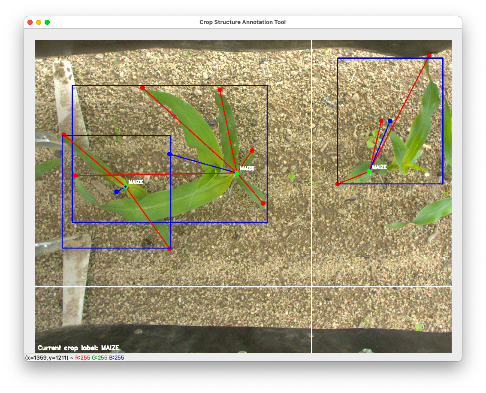

# Structure Annotator 
Software for annotating images with the structure of crops. It was coded with the a\*s in the urge, hope mom and dad won't find out. Use at you own risk. Work still in progress and document is not complete.

## Requirements and Installation
- Python3
- OpenCV
- Mouse with middle button

Installing in a virtual environment is recommended. Download and unzip this repo if needed then `cd` in the main directory and issue in a terminal window:
`pip3 install -r requirements.txt`. This will install required dependencies.

## How to Use
- `cd` in the project directory (should be `StructureAnnotator`).
- Launch the software with `python3 main.py [ARGUMENTS...]`. Read the documentation with `python3 main.py -h` for more information on the arguments.
- Quit with keyboard command `q`.

This software can annotate crops, which are composed of one stem (green), many leaves (red) and one optional bounding box (blue). The crop parts (stem and leaves) are represented as keypoints. Here is the list of commands and actions:
- Double click (left): add a keypoint to the current crop being annotated. The first one will be the stem and the others leaves.
- Drag Gesture (middle click, sorry trackpad users, will update soon): add a bounding box to the current crop.
- Command `a`: creates a new crop. A new crop is automatically generated if none are present on the current image while issuing a creation command.
- Command `z`: undo the last action. Because this software was coded with the a\*s redo is not implemented and if present the bounding box is deleted first.
- Commands `e` and `r`: move to previous or next image. This saves the current annotation file automatically.
- Commands `1` to `9`: change the crop annotation label that will be used when a new annotation is created.
- Command `q`: quits the program.
- Logs can be streamed in real time, open `logs.log` in a console.

## Todo
- [x] Add commands to change image
- [x] Add a command to save annotation
- [x] Add loading of annotations
- [x] Solve issue when input folder is empty
- [ ] Add normalized keypoint point rendering
- [ ] Add label text to figure
- [ ] Command to change folder
- [ ] Change current crop focus

## Will Never Do
- Clean code and refactor
- Add new functionnality
